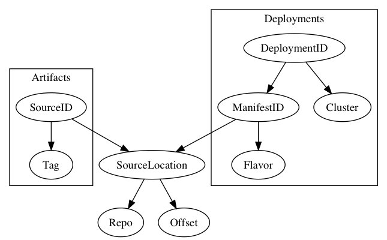
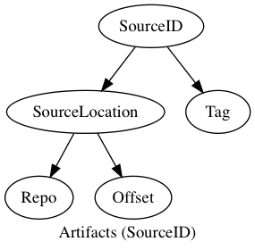
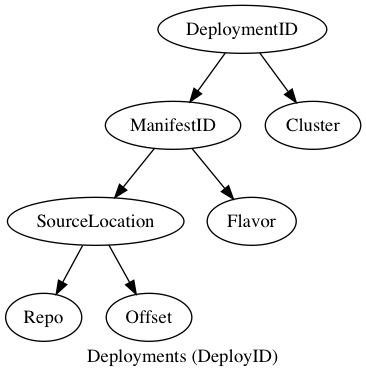

# Sous Taxonomy

Sous deals with two aspects of software: runnable artifacts and running deployments.

Artifacts are the product of a 'sous build' being run against a particular
version of the source code. Right now that means Docker images created from a
specific Git commit (preferably a tagged commit for human readability).

Deployments are a history of related software (typically different _versions_
the same software) and their configurations. Different versions will be deployed
under the same "deployment" over time. Incremental configuration changes can be
made to these deployments as well.

Linking together these long-lived "deployments" with the different versions of
the same software deployed to them is done via an opinionated taxonomy. This
taxonomy is designed to obviate the need to conjure up naming schemes, and to
provide an obvious and common way for engineers and operators to find the
artifacts and deployments they are interested in.

## Artifact Taxonomy

Artifacts are identified by the triple (Repo, Offset, Tag), known as a SourceID.
We refer to the (Repo, Offset) pair by itself as the SourceLocation - this also
forms part of the DeploymentID, see below.

Note that we take the opinion that builds should be as close to reproducible as
possible, and that this triple should be enough to recreate a similar-enough build
later. This is a false assumption made to enable Sous' model for UX purposes.
Under the hood, we maintain a cache of build artifact digests, so that once a
version of your software is deployed, the build artifact that represents it will
not change.

## Deployment Taxonomy

Sous identifies a deployment by its DeploymentID. DeploymentID is a pair,
consisting of ManifestID and Cluster. Cluster is a simple opaque string that
must be pre-defined (currently in `defs.yaml` in the root of the GDM).

ManifestID is a tuple consisting of SourceLocation and Flavor.

SourceLocation is a pair consisting of Repo (URL) and Offset (directory).

Flavor is an arbitrary opaque string whose only purpose is to allow the
creation of an arbitrary number of different manifests. An organisation may
choose to attach meaning to different flavor strings.

## Discussion

Sous considers a source code repository (repo) URL to be the primary key in
organising builds and deployments. It takes this stance because the primary
users of Sous are expected to be developers wanting to deploy code they look
after from a specific repo, and operators who understand deployable artifacts
partly by their relation to the source code that produced them.

This model works for most projects in our experience. However, it does not
map to all projects; not even those at OpenTable.

For example, some repositories may contain source code to produce more than
one distinct artifact. Likewise, a single artifact may need to be deployed
in multiple different configurations.

Thus, while "repo" always forms part of the identifier for a build and deployment
it can be augmented to identify more fine grained things.
